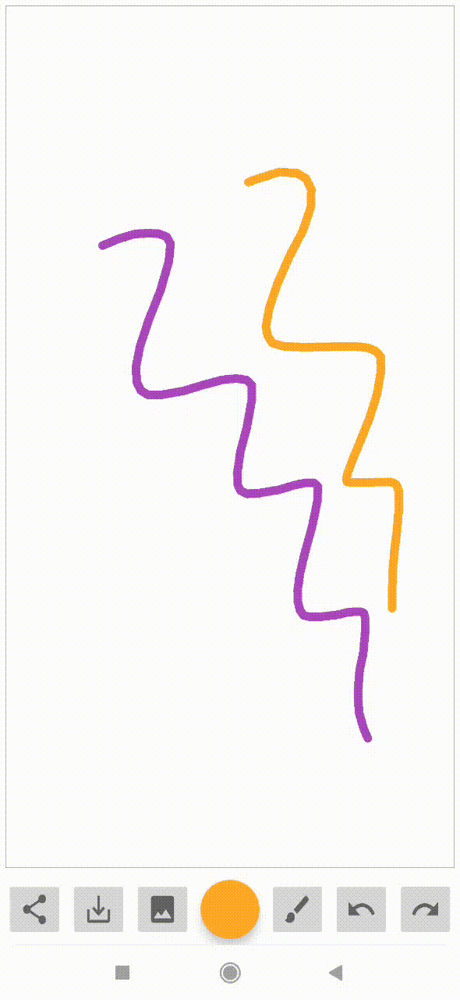
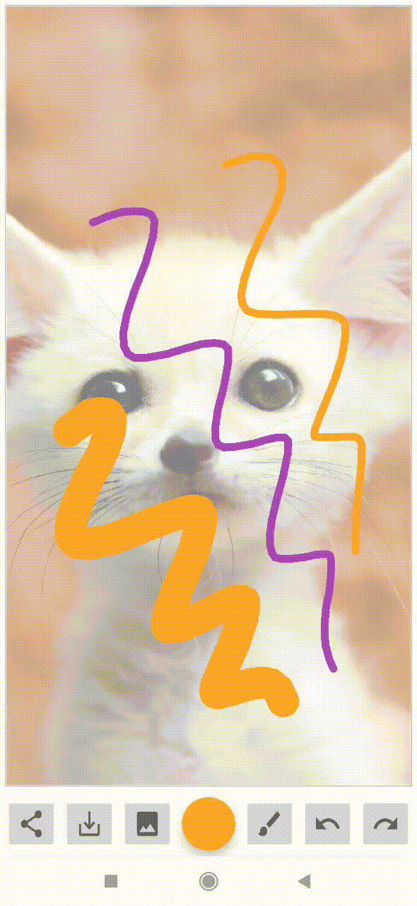

## DrawingApp
An android drawing application for all ages. It comes with 5 different brush sizes, includes color adjustments, undo and redo buttons, import images from the gallery and export your drawings to JPEG. It has an intuitive and user-friendly interface. 

| Open app                  | Select a color          |      
:-------------------------:|:-------------------------:
  | 

| Select brush size        | Redo / Undo              |      
:-------------------------:|:-------------------------:
  |

| Add background and Save  |  Share           |      
:-------------------------:|:-------------------------:
  | 
